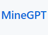

# MineGPT

Chat with ChatGPT in Minecraft.

**Require [Architectury API](https://modrinth.com/mod/architectury-api).**

**Forge侧使用了Fabric Command API (Client side)代码。**

**The Forge side uses the Fabric Command API (Client side) code.**

## 使用-中文

当加载MineGPT后，会生成配置文件。打开config/MineGPT/MineGPT.json，输入你的信息和设置。

以下是例子:  

"API_Link": "https://api.openai.com/v1/completions",  #这个是API的地址  

"API_KEY": "你的OpenAI APIKey",  #这个是你的OpenAI的API密钥  

"MODEL": "text-davinci-003", #这个是AI模型 我选择的是达芬奇模型  

"MAX_TOKEN": "1024", #这里是返回最大信息  

"N": "5" #这里是返回多少次结果

## Usage-English

When MineGPT is loaded, a configuration file will be generated. Open the file at config/MineGPT/MineGPT.json and input your information and settings. 

Here's an example:  

"API_Link": "https://api.openai.com/v1/completions",  // This is the API url

"API_KEY": "Your OpenAI APIKey",  // This is your OpenAI API key  

"MODEL": "text-davinci-003", // This is the AI model. I chose the Davinci model.  

"MAX_TOKEN": "1024",  // This is the maximum number of tokens to return  

"N": "5 // This is the number of responses to return  

# 其他-other

[MCMOD](https://www.mcmod.cn/author/28061.html) | MCTeamPotato.

[GitHub](https://github.com/MCTeamPotato) | MCTeamPotato.
